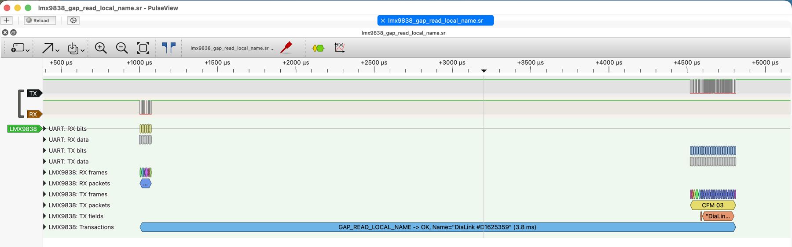
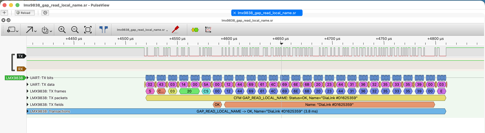

# sigrok protocol decoder for the TI LMX9838 "SimplyBlue" Bluetooth module

A [libsigrokdecode](https://sigrok.org/wiki/Libsigrokdecode) protocol decoder
for the UART command interface of the Texas Instruments (formerly National
Semiconductor) LMX9838 Bluetooth serial port module, as described in
[AN-1699 "LMX9838 Software User's Guide" (SNOA498B)](https://www.ti.com/lit/an/snoa498b/snoa498b.pdf).

The decoder stacks on top of the `uart` decoder and shows:

- **RX/TX frames** - STX, packet type, opcode, length, checksum, data bytes, ETX;
- **RX/TX packets** - one annotation per packet, e.g.
  `CFM GAP_READ_LOCAL_NAME: Status=OK, Name="DiaLink #D1625359"`;
- **RX/TX fields** - decoded data fields of the common GAP/SPP commands
  (status codes, Bluetooth addresses, port numbers, names, SPP payloads);
- **Transactions** - every request paired with its confirm, with the
  response time, e.g. `GAP_READ_LOCAL_BDA -> COMMAND_DISALLOWED (2.8 ms)`;
- **Events** - indications and responses (`IND SPP_INCOMING_DATA: ...`);
- **Warnings** - bad checksum, bad length, missing ETX, unknown opcodes,
  requests without confirm and vice versa.

All 117 opcodes and the generic error codes from AN-1699 are known by name.

## Installation

Copy (or symlink) the `lmx9838` directory into your local decoder directory:

    mkdir -p ~/.local/share/libsigrokdecode/decoders
    cp -r lmx9838 ~/.local/share/libsigrokdecode/decoders/

PulseView and sigrok-cli pick it up on the next start.

## Usage

In PulseView add the **LMX9838** decoder, set the `uart` baudrate to the
speed the module is configured for (factory default 9600, 8N1) and assign
the RX/TX channels. With sigrok-cli:

    sigrok-cli -i dumps/lmx9838_gap_read_local_name.sr \
        -P uart:baudrate=921600:rx=RX:tx=TX,lmx9838 \
        -A lmx9838=transaction:event:warning

    lmx9838-1: GAP_READ_LOCAL_NAME -> OK, Name="DiaLink #D1625359" (3.8 ms)

With all annotation classes enabled the same capture decodes as:

    sigrok-cli -i dumps/lmx9838_gap_read_local_name.sr \
        -P uart:baudrate=921600:rx=RX:tx=TX,lmx9838 \
        -A lmx9838=rx-packet:tx-packet:rx-field:tx-field:transaction

    lmx9838-1: REQ GAP_READ_LOCAL_NAME
    lmx9838-1: Status: OK
    lmx9838-1: Name: "DiaLink #D1625359"
    lmx9838-1: CFM GAP_READ_LOCAL_NAME: Status=OK, Name="DiaLink #D1625359"
    lmx9838-1: GAP_READ_LOCAL_NAME -> OK, Name="DiaLink #D1625359" (3.8 ms)

The direction of the channels does not matter for decoding: the packet
type (REQ/CFM/IND/RES) is taken from the frame itself.

## Contents

- `lmx9838/` - the decoder (`__init__.py`, `pd.py`);
- `dumps/` - example captures (`.sr`) with a README, as submitted to
  [sigrok-dumps](https://github.com/sigrokproject/sigrok-dumps);
- `test/` - test configuration and reference output for
  [sigrok-test](https://github.com/sigrokproject/sigrok-test), plus
  `gen_test.py`, which synthesizes a two-channel UART stream with a set of
  packets for a quick smoke test:

      python3 test/gen_test.py
      sigrok-cli -i test.bin -I binary:numchannels=8:samplerate=9216000 \
          -P uart:baudrate=921600:rx=0:tx=1,lmx9838 -A lmx9838=rx-packet:tx-packet

## License

GPL-2.0-or-later, see `COPYING`.
